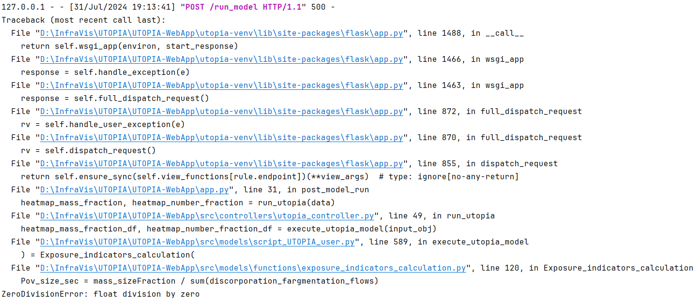

# Errors occurred during model run

## 2024-07-31

### Zero-division error for all ES parameters from 0.5 up to 500

* Microplastics Physical Properties
  * Microplastics Physical Property Composition: **PVC**
  * Density: **1580**
  * Big Bin Diameter: **5000**

* Microplastics Weathering Properties
  * Fragmentation Style: **No Fragmentation**
  
* Emission Scenario
  * MP Form: **Free**
  * Size Bin: **0.5-500**
  * Flow of MPs: **1**
  * Receiving Compartment: **Air**

#### Error message:

